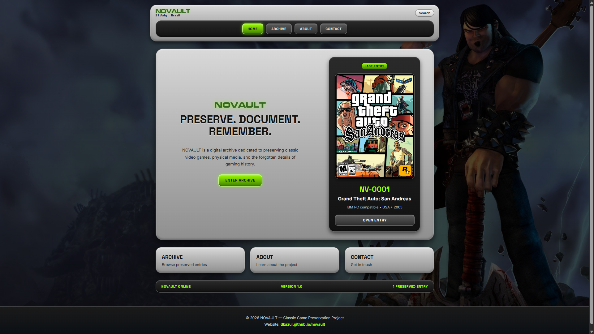

# NOVAULT

Classic Game Preservation Project.

NOVAULT is a digital archive dedicated to preserving the history of classic video games, physical releases, disc data and historical documentation.

## Preview

## Website

🌐 https://dkazul.github.io/novault/

## Features

- Retro inspired interface
- Game preservation archive
- Physical media documentation
- Technical disc information
- Regional release tracking

## Status

Current version: 1.0

Archive entries: 1

Status: Expanding